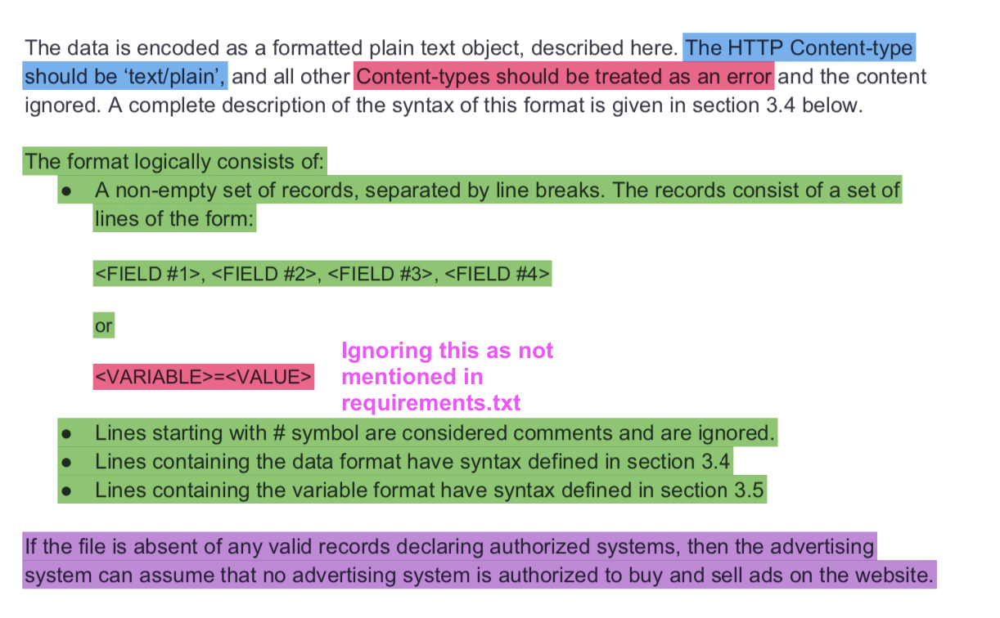

# Crawler ads.txt

<b>--Implementation and assumptions

Referring to the Ads.txt specification v1.0.1, certain assumptions have been taken for the implementation and hence, account for the same. 
</b>
 
 

<i>The code follows the above to parse ads.txt responses for success (2xx) and redirect statuses (3xx) for as many times the root domain is maintained with at max 1 domain change hop delegation. Also, there were a few websites that returned ads.txt content with status of 4xx. However, 4xx status responses have been marked as failures and not saved to db. </i>
 
 
 

 
 
<i>For ads.txt that had content-type other than text/plain are ignored. However, as per my observation, there were a few websites that had content-type text/html for their valid ads.txt file. Regarding the format, the format in green has been followed to store records and since the second format - Variable format(marked in red) wasn't mentioned in the requirement document, it has been ignored.</i>

 
 

# Running the project

<b>Requirements: </b> 
1. Java 
2. PostgreSQL 9.6 or above 
3. Postgres driver JAR for JDBC 

<b>Process: </b> 
1. Configure in Setup.java file, the settings for your db. 
2. Run Init.java file once to create tables and indexes. 
3. Run Crawler.java to start crawling ads.txt files od domains mentioned in <b>res/domainList.txt</b> 

<b>--Table creation SQLs</b>

CREATE TABLE website(
    website_id SERIAL PRIMARY KEY,
    name varchar(100) UNIQUE NOT NULL,
    last_crawled_at timestamp
);

CREATE TABLE advertiser(
    advertiser_id SERIAL PRIMARY KEY,
    name varchar(100) UNIQUE NOT NULL,
    tag varchar(100)
);

CREATE TABLE website_advertiser_relation(
	website_advertiser_relation_id SERIAL PRIMARY KEY,
	website_id INTEGER NOT NULL REFERENCES website(website_id) ON DELETE CASCADE,
	advertiser_id INTEGER NOT NULL REFERENCES advertiser(advertiser_id) ON DELETE CASCADE
);

CREATE TABLE publisher(
    publisher_id SERIAL PRIMARY KEY,
    website_advertiser_relation_id INTEGER NOT NULL REFERENCES website_advertiser_relation(website_advertiser_relation_id) ON DELETE CASCADE,
    account_id varchar(100) NOT NULL,
    account_type varchar(200) NOT NULL,
    UNIQUE (website_advertiser_relation_id, account_id)
);

<b>--Indexes (Explicitly created ones)</b>

CREATE INDEX ON website_advertiser_relation (website_id);

CREATE INDEX ON website_advertiser_relation (advertiser_id);

CREATE INDEX ON publisher (account_id);

<b>--Queries</b>

1. List of unique advertisers on a website. 
Select name from advertiser where advertiser_id IN
(Select advertiser_id from website_advertiser_relation where website_id =
(Select website_id from website where name='steadyhealth.com' limit 1));

2. List of websites that contain a given advertiser.  
Select name from website where website_id IN
(Select website_id from website_advertiser_relation where advertiser_id =
(Select advertiser_id from advertiser where name='google.com' limit 1));

3. List of websites that contain a given advertiser id.  
Select name from website where website_id IN
(Select website_id from publisher where account_id = 'pub-2051007210431666');

4. List of all unique advertisers.  
Select name from advertiser;
